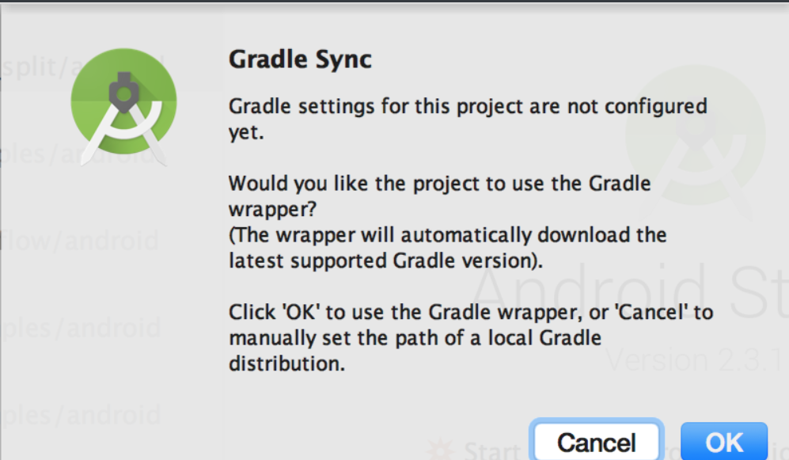
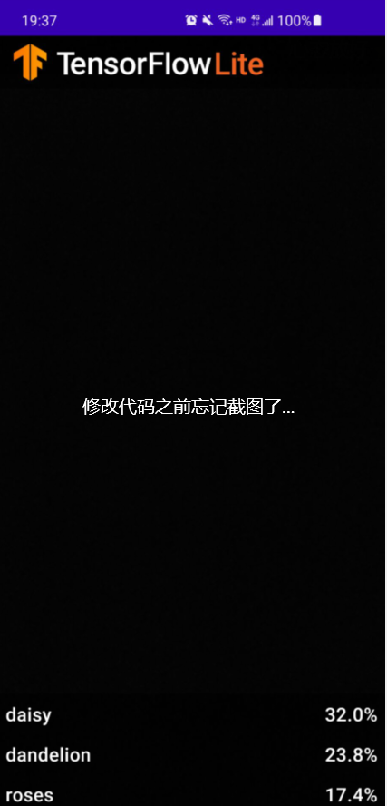
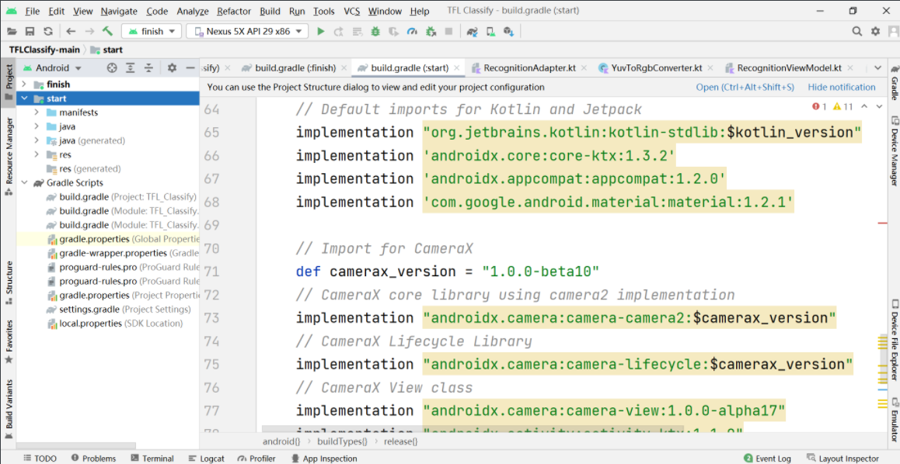
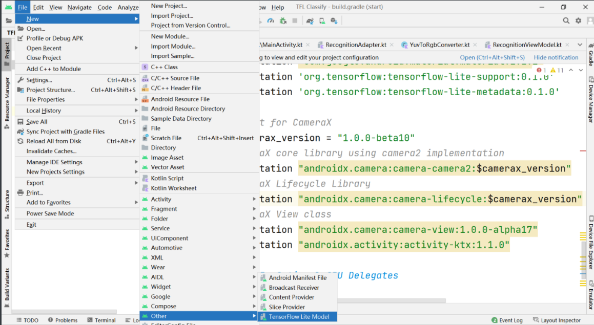
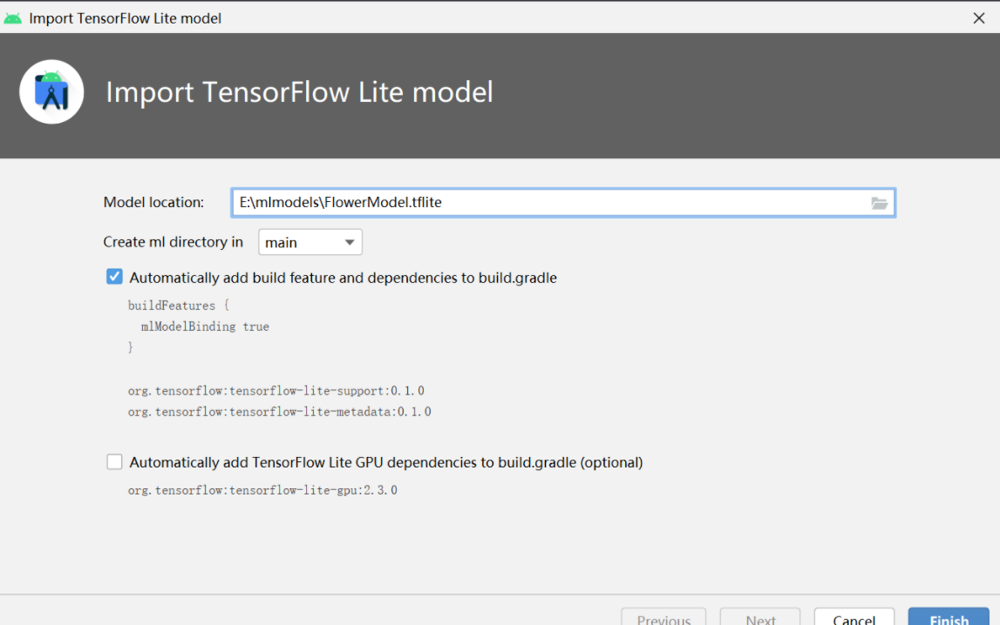
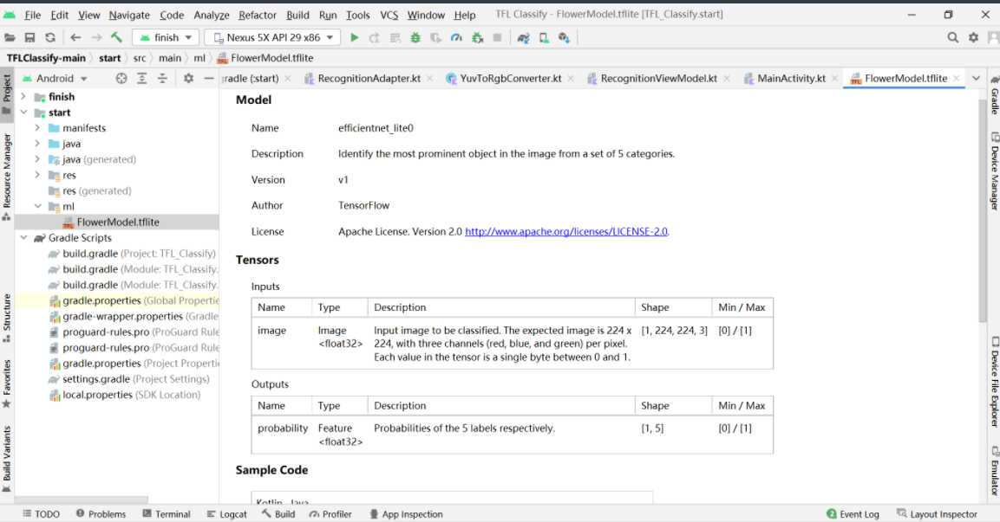
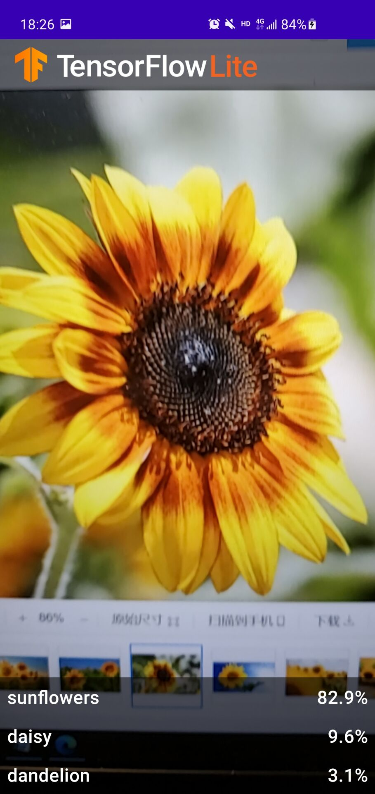

# 实验三 	基于TensorFlow Lite实现的Android花卉识别应用

## 下载初始代码

创建工作目录，使用

`git clone https://github.com/hoitab/TFLClassify.git`

拷贝代码；或者直接访问[github](https://so.csdn.net/so/search?q=github&spm=1001.2101.3001.7020)链接下载代码的ZIP包，并解压缩到工作目录。

## 运行初始代码

1. 选择TFLClassify/build.gradle生成整个项目。项目包含两个module：finish 和 start，finish模块是已经完成的项目，start则是本项目实践的模块。
2. 第一次编译项目时，弹出“Gradle Sync”，将下载相应的gradle wrapper 。
   
3. 手机通过USB接口连接开发平台，并设置手机开发者选项允许调试。
4. 选择真实物理机（而不是模拟器）运行start模块
   
5. 允许应用获取手机摄像头的权限，得到下述效果图，界面利用随机数表示虚拟的识别结果。
   

## 向应用中添加TensorFlow Lite

1. 选择"start"模块
   
2. 右键“start”模块，或者选择File，然后New>Other>TensorFlow Lite Model
   
3. 选择已经下载的自定义的训练模型。本教程模型训练任务以后完成，这里选择finish模块中ml文件下的FlowerModel.tflite。
   
   点击“Finish”完成模型导入，系统将自动下载模型的依赖包并将依赖项添加至模块的build.gradle文件。
4. 最终TensorFlow Lite模型被成功导入，并生成摘要信息
   

## 添加代码重新运行APP

1.定位“start”模块**MainActivity.kt**文件的TODO 1，添加初始化训练模型的代码

```kotlin
private class ImageAnalyzer(ctx: Context, private val listener: RecognitionListener) :
        ImageAnalysis.Analyzer {

  ...
  // TODO 1: Add class variable TensorFlow Lite Model
  private val flowerModel = FlowerModel.newInstance(ctx)

  ...
}
123456789
```

2.在CameraX的analyze方法内部，需要将摄像头的输入`ImageProxy`转化为`Bitmap`对象，并进一步转化为`TensorImage` 对象

```kotlin
override fun analyze(imageProxy: ImageProxy) {
  ...
  // TODO 2: Convert Image to Bitmap then to TensorImage
  val tfImage = TensorImage.fromBitmap(toBitmap(imageProxy))
  ...
}
123456
```

3.对图像进行处理并生成结果，主要包含下述操作：

- 按照属性`score`对识别结果按照概率从高到低排序
- 列出最高k种可能的结果，k的结果由常量`MAX_RESULT_DISPLAY`定义

```kotlin
override fun analyze(imageProxy: ImageProxy) {
  ...
  // TODO 3: Process the image using the trained model, sort and pick out the top results
  val outputs = flowerModel.process(tfImage)
      .probabilityAsCategoryList.apply {
          sortByDescending { it.score } // Sort with highest confidence first
      }.take(MAX_RESULT_DISPLAY) // take the top results

  ...
}
12345678910
```

4.将识别的结果加入数据对象`Recognition` 中，包含`label`和`score`两个元素。后续将用于`RecyclerView`的数据显示

```kotlin
override fun analyze(imageProxy: ImageProxy) {
  ...
  // TODO 4: Converting the top probability items into a list of recognitions
  for (output in outputs) {
      items.add(Recognition(output.label, output.score))
  }
  ...
}
12345678
```

5.将原先用于虚拟显示识别结果的代码注释掉或者删除

```kotlin
// START - Placeholder code at the start of the codelab. Comment this block of code out.
for (i in 0..MAX_RESULT_DISPLAY-1){
    items.add(Recognition("Fake label $i", Random.nextFloat()))
}
// END - Placeholder code at the start of the codelab. Comment this block of code out.
12345
```

6.以物理设备重新运行start模块

修改后代码如下

```kotlin
/*
 * Copyright (C) 2020 The Android Open Source Project
 *
 * Licensed under the Apache License, Version 2.0 (the "License");
 * you may not use this file except in compliance with the License.
 * You may obtain a copy of the License at
 *
 *      http://www.apache.org/licenses/LICENSE-2.0
 *
 * Unless required by applicable law or agreed to in writing, software
 * distributed under the License is distributed on an "AS IS" BASIS,
 * WITHOUT WARRANTIES OR CONDITIONS OF ANY KIND, either express or implied.
 * See the License for the specific language governing permissions and
 * limitations under the License.
 */

plugins {
    id 'com.android.application'
    id 'kotlin-android'

    // Kotlin kapt is recommended for data binding
    id 'kotlin-kapt'
}

android {
    compileSdkVersion 29

    defaultConfig {
        applicationId "org.tensorflow.lite.examples.classification"
        minSdkVersion 21
        //noinspection OldTargetApi
        targetSdkVersion 29
        versionCode 1
        versionName "1.0"

        testInstrumentationRunner "androidx.test.runner.AndroidJUnitRunner"
    }

    buildTypes {
        release {
            minifyEnabled false
            proguardFiles getDefaultProguardFile('proguard-android-optimize.txt'), 'proguard-rules.pro'
        }
    }

    // CameraX requires Java 8, this compileOptions block is required.
    compileOptions {
        sourceCompatibility JavaVersion.VERSION_1_8
        targetCompatibility JavaVersion.VERSION_1_8
    }
    kotlinOptions {
        jvmTarget = '1.8'
    }

    // Enable data binding
    buildFeatures{
        dataBinding = true
        mlModelBinding true
    }

}

dependencies {

    // Default imports for Kotlin and Jetpack
    implementation "org.jetbrains.kotlin:kotlin-stdlib:$kotlin_version"
    implementation 'androidx.core:core-ktx:1.3.2'
    implementation 'androidx.appcompat:appcompat:1.2.0'
    implementation 'com.google.android.material:material:1.2.1'
    implementation 'org.tensorflow:tensorflow-lite-support:0.1.0-rc1'
    implementation 'org.tensorflow:tensorflow-lite-metadata:0.1.0-rc1'

    // Import for CameraX
    def camerax_version = "1.0.0-beta10"
    // CameraX core library using camera2 implementation
    implementation "androidx.camera:camera-camera2:$camerax_version"
    // CameraX Lifecycle Library
    implementation "androidx.camera:camera-lifecycle:$camerax_version"
    // CameraX View class
    implementation "androidx.camera:camera-view:1.0.0-alpha17"
    implementation "androidx.activity:activity-ktx:1.1.0"

    // TODO 5: Optional GPU Delegates


    testImplementation 'junit:junit:4.13'
    androidTestImplementation 'androidx.test.ext:junit:1.1.2'
    androidTestImplementation 'androidx.test.espresso:espresso-core:3.3.0'
}
```

## 查看结果

