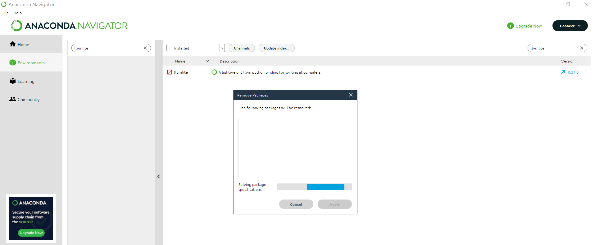

# TensorFlow Lite 模型生成

## 预备工作

首先安装程序运行必备的一些库

`pip install tflite-model-maker -i https://pypi.tuna.tsinghua.edu.cn/simple/`

安装的时候遇到`ERROR: Cannot uninstall 'llvmlite'.`的问题。首先卸载llvmlite包，这里利用Anaconda Navigator中Environments组件管理和卸载相关的Package。

`pip install conda-repo-cli==1.0.4 -i https://pypi.tuna.tsinghua.edu.cn/simple/`

`pip install anaconda-project==0.10.1 -i https://pypi.tuna.tsinghua.edu.cn/simple/`

接下来，导入相关的库。

`import os`

`import numpy as np`

`import tensorflow as tf`
`assert tf.__version__.startswith('2')`

`from tflite_model_maker import model_spec`
`from tflite_model_maker import image_classifier`
`from tflite_model_maker.config import ExportFormat`
`from tflite_model_maker.config import QuantizationConfig`
`from tflite_model_maker.image_classifier import DataLoader`

`import matplotlib.pyplot as plt`

k'j

## 模型训练

### 获取数据

本实验先从较小的[数据集](https://so.csdn.net/so/search?q=数据集&spm=1001.2101.3001.7020)开始训练，当然越多的数据，模型精度更高。

`image_path = tf.keras.utils.get_file(`

​      `'flower_photos.tgz',`
​      `'https://storage.googleapis.com/download.tensorflow.org/example_images/flower_photos.tgz',`
​      `extract=True)`
`image_path = os.path.join(os.path.dirname(image_path), 'flower_photos')`

### 运行示例

一共需4步完成。
第一步：加载数据集，并将数据集分为训练数据和测试数据。

`data = DataLoader.from_folder(image_path)`
`train_data, test_data = data.split(0.9)`

第二步：训练Tensorflow模型

`# 使用在线模型，推荐
inception_v3_spec = image_classifier.ModelSpec(uri='https://storage.googleapis.com/tfhub-modules/tensorflow/efficientnet/lite0/feature-vector/2.tar.gz')`

inception_v3_spec.input_image_shape = [240, 240]
model = image_classifier.create(train_data, model_spec=inception_v3_spec)`

第三步：评估模型

`loss, accuracy = model.evaluate(test_data)`

第四步，导出Tensorflow Lite模型

`model.export(export_dir='.')`

这里导出的Tensorflow Lite模型包含了元数据(metadata),其能够提供标准的模型描述。导出的模型存放在Jupyter Notebook当前的工作目录中。

